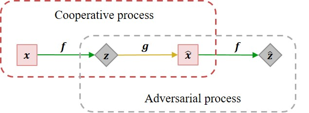








I am a master student in shenzhen istitute of advanced technology, Chiese academy school. before that, I got my bachor degree from central university of finance and economy. 
Now, I major instest in two areas.

**High dimesion data learning**. I am intersted in build a simple, controlled, robust, and efficient system, which would learn good representation, besides, reconstruct and generate new based on what have been learned

**Biomedical data analysis**. I tend you build on a interplate model and system face to real need, asssitant medical decision

# Education
Central university of finance and economy (CUFE) Aug 2016 - June 2020

Chinese academy of science (CAS) Aug 2020 - May 2023 

# Publication and preprints
{:height="25%" width="25%"}      **Cooperative adversarial learning Via Closed-loop transcription** **ruixiao** xinyu zhao (under review)

This paper proposes a generative model that implements cooperative adversarial learning via closed-loop transcription. In the generative model training, the encoder and decoder are trained simultaneously, and not only the adversarial process but also a cooperative process is included.  Cooperative adversarial learning possesses the concepts and properties of Auto-Encoding and GAN, and it is unique in that the encoder actively controls the training process as it is trained in both learning processes in two different roles. Experiments demonstrate that without regularization techniques, our generative model is robust to net architectures and easy to train, sample-wise reconstruction performs well in terms of sample features, and disentangled visual attributes are well modeled in independent principal components.

